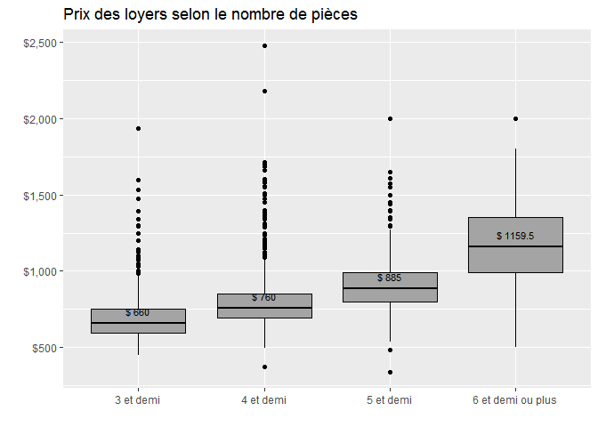
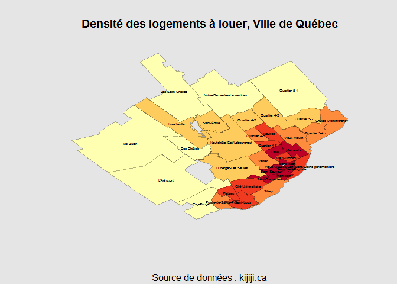
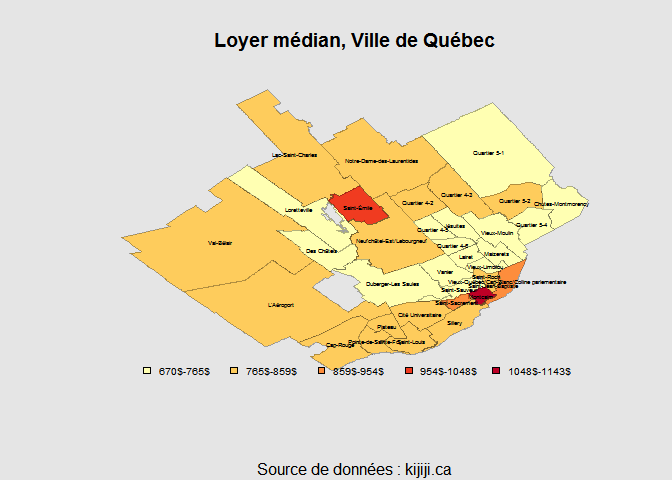

Marché immobilier locatif de la Ville de Québec
================

Avec l'arrivée des beaux temps, c'est bientôt la saison du dénénagement au Québec. Les annonces de logements à louer apparaissent à tous les coins de rue et sur *kijiji.ca*, site de petites annonces gratuit très populaire au Québec. Ces annonces sur *kijiji* constituent une excéllente source de données pour analyser le marché immobilier locatif de la Ville de Québec.

Pour recueillir de l'informations sur le prix, le nombre de pièces et l'adresse des logements à louer à la Ville de Québec depuis *kijiji*, j'utilise **Scrapy**, un module de web scraping en **Python**. Les données analysées ici proviennent des annonces qui apparaissaient sur les 20 premières pages de la section *location des appartements et des condos* de *kijiji* le 13 mai 2017. J'utilise ensuite **R** pour la visualisation des données sur une carte de la Ville de Québec. Les polygones des quartiers de la Ville de Québec utilisées ici sont disponibles sur le site [données ouvertes Ville de Québec](http://donnees.ville.quebec.qc.ca/donne_details.aspx?jdid=9). Tous les scripts utilisés pour faire ce post peuvent être retrouvés [ici](https://github.com/chuyachia/kijiji_map).

### Prix des loyers selon le nombre de pièces

La distribution du prix des loyers selon le nombre de pièces est presentée dans le graphique suivant. Marqué par la barre au milieu est le loyer médian. Sans surprise, le prix tend à augmenter avec le nombre de pièces. Il peut également être constaté que la distribution du prix est oblique à droite. Cette longue queue reflète l'existance d'une petite quantité de logements qui sont à un prix beaucoup plus élevé que ce qu'on peut attendre d'une distribution normale (les logements de luxe).

### Densité des logements à louer par quartier

La Ville de Québec est divisée en 35 quartiers de superficie et de densité très variée. La carte suivante présente la densité des logements à louer dans ces 35 quartiers. La densité des logements à louer est calculée par le ratio entre le nombre de logements à louer et la superficie du quartier. Nous constatons que les quartiers du centre-ville sont ceux où il y a le plus grand nombre de logements à louer par superficie (Notons également que ces quartiers sont aussi généralement plus petits en superficie). Ainsi, le quartier où il existe la plus grande concentration de logements à louer est *Saint-Jean-Baptiste*, suivi par *Saint-Sacrement*, *Lairet*, *Montcalm* et *Saint-Sauveur*.

### Loyer médian par quartier

Une comparaison du loyer médian nous montre clairement la disparité entre les quartiers. Pour les habitants de le Ville de Québec, il n'est pas surprenant d'apprendre que *Montcalm* est le quartier le plus cher de la ville (avec un loyer médian de $1142). Le deuxième quartier le plus cher de la ville, curieusement, est *Saint-Émile* (loyer médian $985), un quartier plutôt éloigné du centre. Notons cependant que nous disposons peu d'observations pour ce quartier (nous avons seulement 13 observations pour *Saint-Émile* alors que le nombre moyen d'observations par quartier est de 44) et que la plupart de logements dans ce quartier sont plus grands (5 et demi) que ceux que nous trouvons au centre-ville (3 et demi ou 4 et demi). D'autres quartiers chers de la ville inclurent *Vieux-Québec/Cap-Blanc/Colline parlementaire* ($892), *Saint-Sacrement* ($870) et *Cité Universitaire* ($850). De l'autre côté, parmi les quartiers les moins chers, nous trouvons *Vieux-Moulin* ($670), *Chutes-Montmorency* ($685), *Lairet* ($690), *Maizerets* ($695) et *Saint-Sauveur* ($695). Nous pouvons remarquer une séparation assez nette entre la Haute-Ville et la Basse-Ville. En effet, entre le quartier le plus cher de la ville, *Montcalm* et son voisin du nord *Saint-Sauver* qui est l'un des quartier les moins chers, il existe une haute fallaise qui marque la frontière Haute-Ville Basse-Ville.

### Écart type des loyers par quartier

En plus de la différence inter-quartiers, la différence intra-quartier peut également nous en dire beaucoup sur le marché immobilier locatif. Ici, nous nous concentrons sur les quartiers pour lesquels nous avons plus que 30 observations. La carte suivante présente l'écart type des loyers dans ces quartiers. Le quartier où le prix du loyer varie le plus est *Saint-Roch*. Ce résultat me paraît particulièrement intéressant dans le contexte où la gentrification de cet ancien quartier populaire se fait beaucoup parler d'elle. Derrière *Saint-Roch*, *Vieux-Québec/Cap-Blanc/Colline parlementaire*, *Montcalm*, *Saint-Sacrement* et *Neufchâtel-Est/Lebourgneuf* sont tous les quartiers où nous trouvons une grande variation du prix des loyers.

